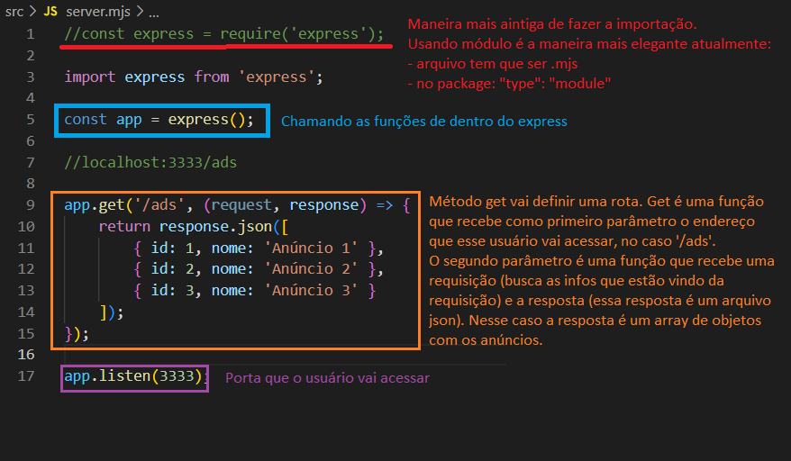

# Find your Duo

Proojeto desenvolvido no projeto NLW eSports da Rocketseat.

## Ferramentas utilizadas

- Backend com Node;
- Vizualização/testes das rotas criadas com [Hoppscotch](https://hoppscotch.io/pt-br/);
- Typescript;
- Vite para criar projeto React;
- Estilização com [Tailwind](https://tailwindcss.com/);
- Biblioteca de íconer [Phosphor icons](https://phosphoricons.com/);
- Banco de dados SQLite;
- Biblioteca de componentes Ui [Radix](https://www.radix-ui.com/);

## Aprendizado

- Criar banco de dados com Node;
- Criar rotas com Express;
- Ferramentas para visualizar/testar as rotas criadas:
    - [Insomnia](https://insomnia.rest/download);
    - [Postman](https://www.postman.com/);
    - [Hoppscotch](https://hoppscotch.io/pt-br/).

- Iniciar aplicação React com [Vite](https://vitejs.dev/);
- Iniciar aplicação React Native com [Expo](https://expo.dev/);

## Back-end

### Entidades

#### Games

- id;
- title;
- bannerUrl.

#### Ad

- id;
- gameId;
- name;
- yearsPlaying;
- discord;
- weekDays;
- hourStart; (as horas serão salvas em minutos, já que é mais fácil de fazer a manipulação)
- hourEnd;
- useVoiceChannel;
- createdAt.

Obs.: tentar salvar sempre números inteiros no banco de dados
 
1:30h -> 90 min
 
R$ 179,89 -> 17989 (x100)
 
Datas (fuso horário/formatos)

#### Games

- listagem de games com contagem de anúncios;
- criação de novo anúncio;
- listagem de anúncios por game;
- buscar discord pelo id do anúncio.

## Notas de aula

### Node

1. Criar pasta server;
2. Iniciar projeto com `npm init -y`;
3. Instalar dependência Express: `npm install express`;
4. Importar express como módulo;
5. Criar rota: 

6. Instalar Typescript como depndência de desenvolvimento, pois o Node não entende essa linguagem: `npm i typescript -D`
7. Criar script para converter TS para JS. No arquivo package:
    "scripts": {
        "build": "tsc"
    }
8. Criar arquivo de configuração do TS com `npx tsc --init`. Algumas configurações já estão feitas;
9. No tsconfig mudar modules para ES2020;
    Configurações:
    "module": "ES2020",
    "rootDir": "./src" --> diretório raiz da aplicação
    "outDir": "./build" --> arquivos compilados estarão na pasta build
    "moduleResolution": "node"
Obs.: sempre que mudar alguma configuração rodar novamente o `npm run build`
10. Express não tem suporte ao TS, por isso tenho que instalar uma biblioteca adicional (ver documentação do express): `npm install @types/express -D`
11. Fazer a aplicação atualizar sempre que mudar o código: `npm i ts-node-dev -D`
    No arquivo package.json:
        "scripts": {
            "build": "tsc",
            "dev": "tsnd src/server.ts" --> arquivo que quero rodar
        }
        apagar o type: module
    No tsconfig:
        "module": "commonJs"
    Rodar a aplicação para assistir as mudanças: `npm run dev`

### React

#### Preparação do ambiente - Aula 1

1. Criar pasta web;
2. Começar projeto React com Vite: `npm create vite@latest`. Ir preenchendo as informações;
3. Com o projeto criado salvar as dependências `npm install`;
4. Excluir da pasta src os seguintes arquivos:
    - pasta assets;
    - todos os arquivos css;
    - tirar do arquivo main as impotações do css;
    - no arquivo App, remover todas as importações.
5. `npm run dev` para abrir a aplicação no navegador.

#### Aula 2

1. Instalar tailwind (ver documentação para instalar using PostCSS). Basicamente são 2 comandos: `npm install -D tailwindscss postcss autoprefixer` e `npx tailwindcss init`
2. Fazer configurações que a biblioteca pede:
    - content: [ --> mostrar quais arquivos vão usar o tailwind (todos os arquivos que estão dentro de src com o sufixo tsx)
        './src/**/*.tsx',  
    ]
    - criar pasta styles dentro de src. Criar arquivo main.css e copiar o que a biblioteca pede
3. Rodar o comando `npx tailwindcss init -p`
4. Importar o styles.css no arquivo App;
5. Instalar o phosphor icons com `npm i phosphor-react` (ver documentação);

### React Native

1. Iniciar o projeto React Native com Expo: `npx expo init mobile`, selecionar blank(Typescript)
2. Abrir projeto no celular: `npx expo start`

    
 
